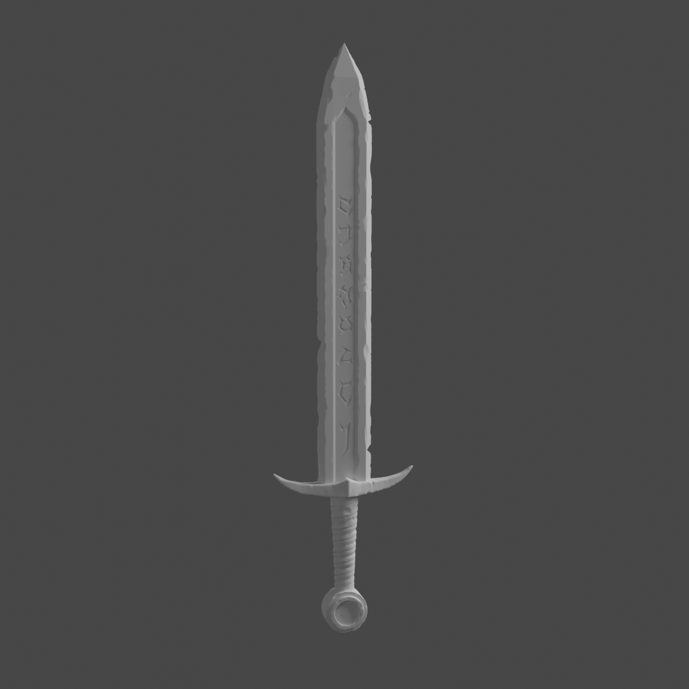
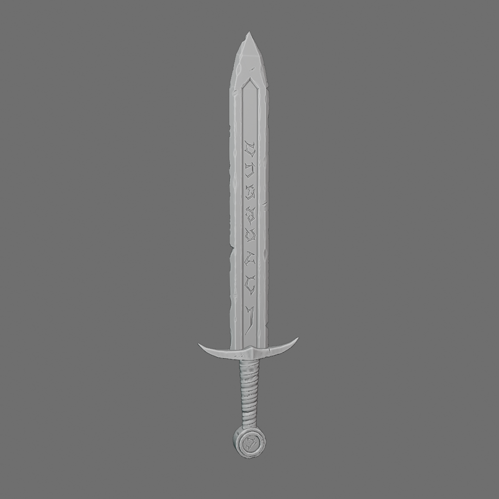
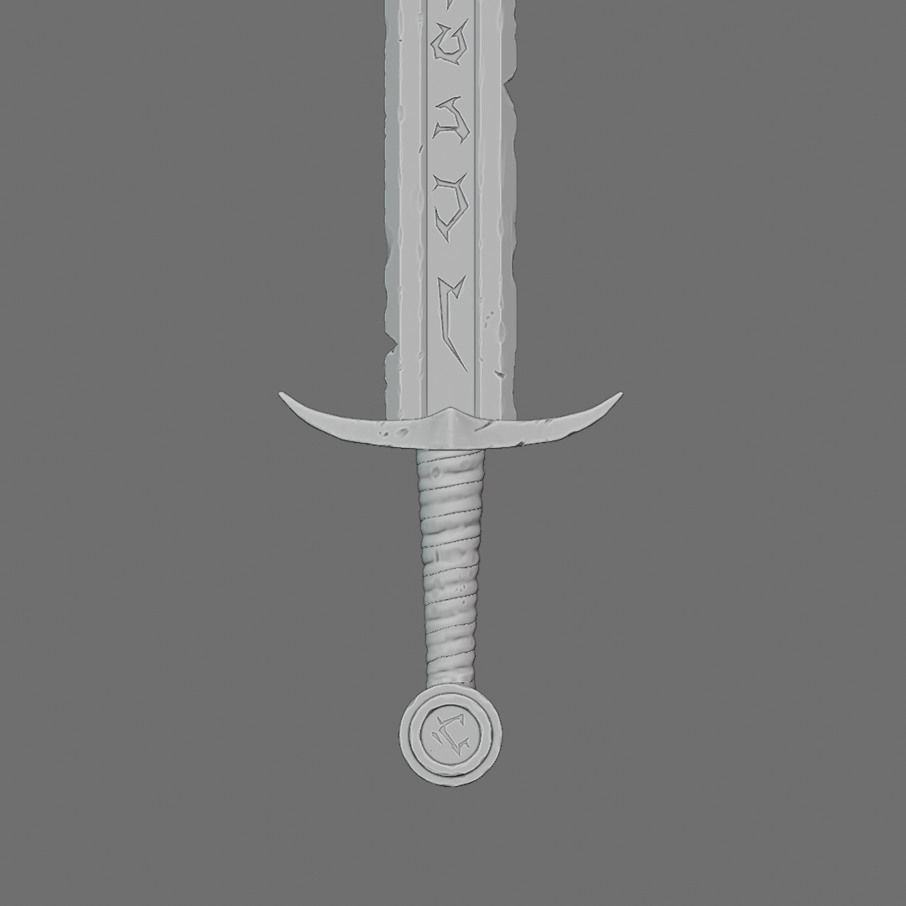
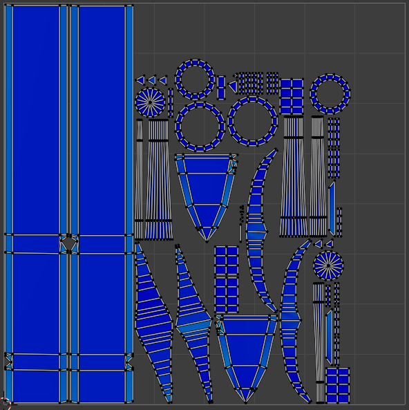

# Coursework for "Blender Sculpting - Rune Sword"

This contains the work created when completing the course [Blender Sculpting - Rune Sword](https://www.udemy.com/course/blender-sculpting-rune-sword/).

The course involved the creation of a "Rune Sword" model. Section 1 of the course was a
course introduction. In Section 2, a low-poly mesh of the sword is created. In Section 3,
the resolution of the mesh was increased and fine details were sculpted into the mesh. The
final section involved decimating the sculpted mesh, realigning the sculpted mesh and the
low poly mesh and developing a useful UV mapping.

<table width="100%">
<tbody>
<tr>
<td>
<figure>
<figcaption>Section 1: A render of the low-poly sword</figcaption>

</figure> 
</td>
<td>
<figure>
<figcaption>Section 2: A render of the sculpted sword</figcaption>

</figure> 
</td>
</tr>
<tr>
<td>
<figure>
<figcaption>Section 2: A render of the high-poly sword without lights to emphasize the detail</figcaption>

</figure> 
</td>
<td>
<figure>
<figcaption>Section 2: A close-up render of the high-poly sword without lights to emphasize the detail</figcaption>

</figure> 
</td>
</tr>
<tr>
<td>
<figure>
<figcaption>Section 3: A representation of UV mapping for the objects with all the UV islands present on single sheet</figcaption>

</figure> 
</td>
</tr>
</tbody>
</table>
